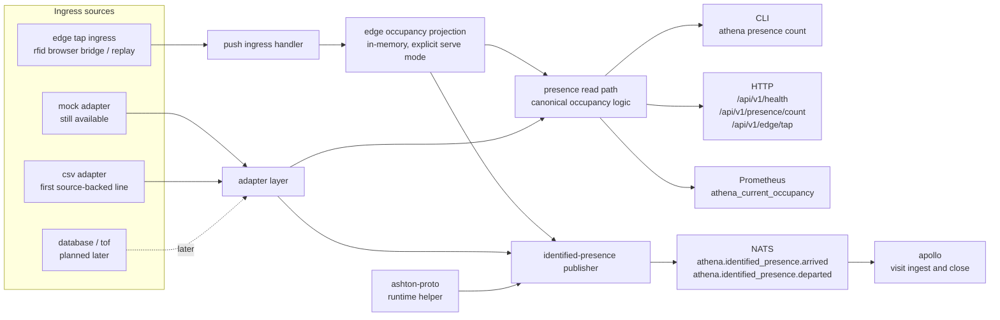

# athena

ATHENA is the first executable service in ASHTON. It owns physical truth:
presence, ingress source handling, occupancy visibility, and the first event
publication path that other repos depend on.

> Current real slice: mock-backed and CSV-backed presence input for the
> canonical occupancy read path, push-based edge tap ingress for identified
> visit lifecycle publication, explicit in-memory edge-driven occupancy
> projection for `serve`, Postgres-backed append-only edge observations with
> derived session facts and bounded internal analytics reads, bounded
> retry/backoff publication with bounded process-local dedupe, bounded live
> browser-reachable deployment of the narrower `v0.4.1` edge path, and shared
> `ashton-proto` runtime contracts for arrival and departure events.

The repo is still growing, but it is no longer docs-first. The important thing
now is to document the real narrow slice honestly while leaving wider adapter,
prediction, and storage plans clearly marked as future work.

## Start Here

| Reader | Start With | Why |
| --- | --- | --- |
| Recruiter or interviewer | [`Runtime Surfaces`](#runtime-surfaces), [`Current State Block`](#current-state-block), [`Why ATHENA Matters`](#why-athena-matters) | These sections show the real service boundary quickly |
| Engineer | [`Architecture`](#architecture), [`Technology Stack`](#technology-stack), [`docs/edge-observation-history-plan.md`](docs/edge-observation-history-plan.md), [`Known Caveats`](#known-caveats) | These sections show how the service works, how edge truth is planned to persist, and where it is still incomplete |
| Operator | [`docs/runbooks/mock-slice.md`](docs/runbooks/mock-slice.md), [`docs/runbooks/source-backed-ingress.md`](docs/runbooks/source-backed-ingress.md), [`docs/runbooks/edge-ingress.md`](docs/runbooks/edge-ingress.md) | These runbooks cover the narrow paths that are actually proven |

## Architecture

The standalone Mermaid source for this flow lives at
[`docs/diagrams/athena-read-and-publish.mmd`](docs/diagrams/athena-read-and-publish.mmd).

## Runtime Surfaces

| Surface | Path / Command | Status | Notes |
| --- | --- | --- | --- |
| HTTP health | `GET /api/v1/health` | Real | Returns service status and adapter name |
| HTTP occupancy count | `GET /api/v1/presence/count` | Real | Reads through the canonical occupancy path; in `ATHENA_EDGE_OCCUPANCY_PROJECTION=true` serve mode this is the in-memory edge projection |
| HTTP edge tap ingress | `POST /api/v1/edge/tap` | Real when edge ingress is configured | Validates per-node tokens, hashes raw IDs, writes privacy-safe append-only observations when `ATHENA_EDGE_POSTGRES_DSN` is set, and preserves the current accept/publish/projection contract |
| HTTP history read | `GET /api/v1/presence/history` | Real, bounded internal support | Reads privacy-safe facility-filtered history from the configured durable store and returns only `direction`, `result`, `observed_at`, and `committed` |
| HTTP analytics read | `GET /api/v1/presence/analytics` | Real, bounded internal support | Reads Postgres-backed observation and session analytics by facility, zone, node, and time window; stays internal and bounded instead of widening into dashboards |
| HTTP facility catalog | `GET /api/v1/facilities` | Real, internal-only, config-gated | Reads facility summaries from `ATHENA_FACILITY_CATALOG_PATH`; returns `facility_id`, `name`, and `timezone` only |
| HTTP facility detail | `GET /api/v1/facilities/{facility_id}` | Real, internal-only, config-gated | Reads one facility's hours, zones, closure windows, and bounded metadata from the same validated catalog file |
| Prometheus metrics | `GET /metrics` | Real | Exposes `athena_current_occupancy` from the same default read path as HTTP |
| Serve command | `athena serve` | Real | Starts the HTTP server in either adapter-backed mode or explicit edge-projection mode |
| CLI count | `athena presence count --format text|json` | Real | Uses ATHENA's canonical adapter-backed read path; live edge projection is a `serve` runtime mode |
| CLI facility catalog | `athena facility list --catalog-path ...` | Real, internal-only | Lists facility summaries from the validated catalog file used by the internal HTTP surface |
| CLI facility detail | `athena facility show --facility <id> --catalog-path ...` | Real, internal-only | Shows one facility's hours, zones, closure windows, and bounded metadata without inventing derived scheduling answers |
| Raw TouchNet replay | `athena edge replay-touchnet` | Real | Replays raw TouchNet report exports through the same edge ingress path used by the live browser bridge |
| Internal durable history read | `athena edge history --postgres-dsn ...` | Real, internal-only | Reads recent append-only durable observations through a CLI-only surface over hashed identities |
| Internal analytics read | `athena edge analytics --postgres-dsn ...` | Real, internal-only | Reads bounded Postgres-backed observation, flow, occupancy, and derived-session analytics over a requested window |
| One-shot arrival publish | `athena presence publish-identified` | Real | Publishes the current identified-arrival batch through NATS |
| One-shot departure publish | `athena presence publish-identified-departures` | Real | Publishes the current identified-departure batch through NATS |
| Background publish worker | `athena serve` with `ATHENA_NATS_URL` and adapter-backed mode | Real | Dedupes inside a bounded process-local window and retries transient publish failures with bounded backoff on the configured interval |
| CSV ingress adapter | `ATHENA_ADAPTER=csv` plus `ATHENA_CSV_PATH` | Real | Loads a bounded physical-truth CSV export into the canonical occupancy read model |
| Prediction endpoints | - | Planned | Preserved in ADRs, not implemented in runtime |
| Additional real ingress adapters | - | Planned | CSV is the only source-backed adapter today |

## Technology Stack

| Layer | Technology | Status | Line | Notes |
| --- | --- | --- | --- | --- |
| Service runtime | Go 1.23 | Instituted | `v0.0.x` -> `v0.3.x` | First executable Go service in the platform |
| HTTP router | chi | Instituted | `v0.1.x` -> `v0.3.x` | Minimal API surface over `net/http` |
| CLI | Cobra | Instituted | `v0.1.x` -> `v0.4.x` | `serve`, `presence count`, publish helpers, and raw TouchNet replay are real |
| Metrics | `prometheus/client_golang` | Instituted | `v0.1.x` -> `v0.3.x` | Reads through the same default occupancy path as the active HTTP runtime |
| Eventing | NATS | Instituted | `v0.3.x` | Used for identified visit-lifecycle publication |
| Shared contract | `ashton-proto` generated types + runtime helper | Instituted | `v0.1.x` -> `v0.3.x` | Publishes bytes from the shared contract path |
| Adapter model | Mock adapter | Instituted | `v0.1.x` -> `v0.4.x` | Deterministic fixtures remain available for tests and bounded smoke |
| Real ingress adapter | CSV presence-event adapter plus push-based edge ingress | Real | `v0.4.x` | CSV remains replay/import truth; edge ingress is the live source when explicit projection mode is enabled |
| Live occupancy projection | In-memory identity and aggregate projection with bounded absent-state retention and cap handling | Real, explicit | `v0.4.x` | `pass` edge events can now drive live occupancy in bounded live deployment without widening persistence |
| Durable edge history | Append-only Postgres observation tables plus commit markers | Real, explicit, repo/runtime | later than `v0.6.1` | Stores privacy-safe `pass` and `fail` observations append-only without leaking raw account values, names, or free-text status messages |
| Derived session analytics | Postgres-backed `edge_sessions` read model plus bounded internal HTTP/CLI reads | Real, internal-only | later than `v0.6.1` | Derives `open`, `closed`, and `unmatched_exit` session facts from accepted `pass` observations without rewriting the original observation history |
| Legacy file-backed history | Append-only file journal plus replay helper | Still available, explicit fallback | `v0.5.0` | Keeps the older local/runtime durable-history path available when Postgres is not configured, but it is no longer the primary storage line for this repo/runtime slice |
| Container build | Docker multi-stage build | Instituted | `v0.2.x` -> `v0.3.x` | Image build path is real |
| CI | GitHub Actions image workflow | Instituted | `v0.2.x` -> `v0.3.x` | Build and image workflow exist in repo |
| Redis utility layer | Redis | Deferred | later than `v0.5.0` | Useful later for hot counters and short-lived aggregates |
| Facility truth catalog | validated file-backed facility catalog plus CLI/internal HTTP reads | Real, internal-only, config-gated | `v0.6.0` | Keeps facility truth ATHENA-owned without activating Postgres or widening into scheduling logic |
| Prediction engine | EWMA + historical binning | Deferred | later than `v0.6.0` | ADR-preserved design, not runtime truth yet |

## Data Ownership And Boundaries

| ATHENA Owns | ATHENA Does Not Own |
| --- | --- |
| physical presence events | member auth |
| occupancy counts and source classification | profile visibility and availability intent |
| ingress-source normalization | workout history |
| identified visit-lifecycle publication to the shared event bus | matchmaking and lobby state |

ATHENA is the physical truth layer. Tap-in or presence changes what happened in
the facility. It does not decide whether someone wants to be visible,
recruitable, or part of a team flow. That intent lives in APOLLO.

## Current Publication Path

| Step | Current Behavior |
| --- | --- |
| Source events enter ATHENA | The mock adapter and the CSV adapter feed the canonical read model, while the edge tap ingress accepts push-based browser or replay input for identified lifecycle publication |
| ATHENA filters for publishable visit lifecycle events | Only identified `in` and `out` events qualify |
| ATHENA builds wire bytes | Publication uses the shared `ashton-proto` runtime helper, not a private JSON struct |
| ATHENA publishes to NATS | Subjects are `athena.identified_presence.arrived` and `athena.identified_presence.departed` |
| APOLLO consumes the events | Downstream visit open/close stays idempotent and separate from workout or lobby state |

The publish worker keeps a bounded process-local seen set so it does not
republish the same mock arrivals on every polling interval, and transient
publish failures now retry with bounded backoff instead of spinning
indefinitely. In explicit edge-projection mode, the live tap path publishes
directly from normalized pass events after the projection accepts them. When
`ATHENA_EDGE_POSTGRES_DSN` is set in projection mode, ATHENA replays committed
`pass` observations from Postgres into a fresh projector before it starts
serving HTTP. The older `ATHENA_EDGE_OBSERVATION_HISTORY_PATH` fallback still
supports the same replay posture for local/runtime compatibility when Postgres
is not configured. Cross-restart publish dedupe is still intentionally left to
downstream idempotency.

## Edge Observation Note

The TouchNet browser bridge now sends more than just the publishable identity
slice. ATHENA can observe:

- raw `account_raw`
- `account_type` such as student-number-style `Standard` or card-style `ISO`
- `name` when TouchNet resolves it
- `status_message`
- `result` as `pass` or `fail`
- inferred `direction` as `in` or `out`

Current runtime behavior is intentionally split:

- `pass` observations can become identified arrival or departure events
- `pass` observations can also update the in-memory live occupancy projection
  when `ATHENA_EDGE_OCCUPANCY_PROJECTION=true`
- `fail` observations are logged for operator diagnostics and reconciliation but
  are not yet published as visit-lifecycle events
- authorized observations can be written append-only when
  `ATHENA_EDGE_POSTGRES_DSN` is set, with the older
  `ATHENA_EDGE_OBSERVATION_HISTORY_PATH` path retained only as a legacy local
  fallback
- the durable record stores the hashed identity plus bounded operational fields,
  but does not store raw account values, resolved names, or free-text
  `status_message`
- accepted `pass` observations now derive session facts with explicit
  `open`, `closed`, and `unmatched_exit` states
- the canonical published identifier remains the hashed account value, not the
  raw student or RFID number

This matters because operators may need to reconcile multiple identifiers for
the same person: student number, RFID card number, and resolved name. ATHENA
now ingests enough context to support later admin or operator workflows, but it
does not yet expose a public or identity-level query API for that observed edge
history.

The current durable groundwork is intentionally narrow:

- the read surface is still CLI/internal-only through `athena edge history`,
  `athena edge analytics`, one bounded internal HTTP facility-history read,
  and one bounded internal HTTP analytics read
- restart/reload rebuilds occupancy from committed `pass` observations only
- manager-grade flow and occupancy reads come from the Postgres-backed durable
  store and derived session facts, not from ad hoc memory or log scraping
- browser and replay event-id derivation may still drift; ATHENA preserves the
  supplied `event_id` and does not claim cross-source event-id reconciliation

If `Hermes` is the intended admin-facing service, it is a reasonable future
surface for those reconciliation endpoints, with ATHENA remaining the ingest,
hashing, and normalization boundary.

The planning doc for durable history, session inference, and alias handling now
lives at [`docs/edge-observation-history-plan.md`](docs/edge-observation-history-plan.md).

## Known Caveats

| Area | Current caveat | Why it matters |
| --- | --- | --- |
| Container CLI mode | The Docker image now defaults to `athena serve`, so CLI-only container use must override the command explicitly | Default runtime behavior now matches HTTP-service deployments instead of printing help and exiting |
| Edge ingress logs | Routine edge logs redact raw account values and resolved names, and the Postgres durable store keeps the same privacy boundary | Safer diagnostics and derived-session groundwork exist now, but there is still no public or operator search surface |
| Persistence | Postgres-backed append-only observation storage and derived session facts are now the primary repo/runtime truth when `ATHENA_EDGE_POSTGRES_DSN` is set; the older file path remains a fallback only | Readers should not confuse repo/runtime truth with deployed truth, and they should not assume occupancy snapshots or public dashboards exist |
| Publish dedupe | Republish protection is bounded and process-local, and worker retries are bounded per cycle | Restart safety still depends on downstream idempotency; durable history is not a publish ledger |
| Replay posture | Restart still rebuilds occupancy by replaying committed observations instead of loading a durable occupancy snapshot | Deterministic and honest today, and replay remains authoritative for occupancy truth even though stale/duplicate suppression for evicted absent identities is now bounded by projector retention and cap |
| Projection mode | Edge-driven occupancy requires an explicit `ATHENA_EDGE_OCCUPANCY_PROJECTION=true` serve config | This tracer changes the occupancy source intentionally, not by config accident |
| Health and metrics | The surfaces are useful, but still narrower than a mature production service would expose | Good for the tracer, not yet the final observability story |

## Current State Block

### Already real in this repo

- deterministic mock fixtures back the first read path
- a source-backed CSV adapter can now drive the same occupancy read path locally
- a push-based edge ingress can authenticate per-node clients, hash raw account ids, and publish identified arrival and departure events through NATS
- an explicit in-memory edge occupancy projection can now drive `/api/v1/presence/count` and Prometheus from the same normalized pass-event stream used for identified publication, while absent identities stay bounded by retention and cap
- a Postgres-backed append-only durable observation store can now write both
  `pass` and `fail` observations behind the same ingress path without changing
  the live response contract
- accepted `pass` observations now derive Postgres-backed session facts with
  explicit `open`, `closed`, and `unmatched_exit` states
- projection-mode restart can now rebuild occupancy deterministically from
  committed `pass` observations in the durable store before serving HTTP
- raw TouchNet access reports can replay through the same edge ingress route used by the live browser bridge
- unknown facilities resolve to a safe zero count instead of panicking or going
  negative
- HTTP and Prometheus share one canonical default occupancy path per active
  serve mode, while CLI count remains adapter-backed outside the live runtime
- a validated file-backed facility catalog can now back internal HTTP and CLI
  facility-truth reads for summaries, hours, zones, closure windows, and
  bounded metadata when `ATHENA_FACILITY_CATALOG_PATH` is set
- bounded internal HTTP and CLI analytics reads can now answer manager-grade
  occupancy, flow, node, and stay-duration questions from real Postgres-backed
  observation/session truth
- config validation fails fast for invalid adapter and interval settings
- the identified arrival and departure paths can publish through NATS using
  shared `ashton-proto` helper code
- local manual smoke has already been used to exercise both one-shot publish and
  worker-driven publish against real NATS
- the bounded live deployment now proves browser-reachable HTTPS edge ingress,
  in-memory occupancy updates, Prometheus count updates, direct NATS subject
  movement, and raw TouchNet replay through the same live `/api/v1/edge/tap`
  path

### Real but intentionally narrow

- the CSV adapter is local-runtime proof only and does not widen the existing
  live deployment claim
- live edge-driven occupancy is explicit serve-mode behavior only; it does not
  widen the current deployment claim beyond one bounded facility and node
  rollout
- the metric surface is intentionally small
- publication is limited to identified visit lifecycle events because that is
  the only cross-repo slice that is real today
- durable edge history and session analytics stay internal-only through bounded
  CLI/internal HTTP reads; there is still no public or identity-level operator
  HTTP surface for that history
- facility truth is file-backed and internal-only; ATHENA does not invent
  facility defaults from occupancy, dormant Postgres schema files, or mock-only
  settings
- the facility catalog routes stay read-only and avoid derived answers like
  `is_open_now`, next-slot generation, reservation policy, or sport capability
- the live browser path is still a narrow Cloudflare quick tunnel in front of a
  proxy that exposes only `/api/v1/edge/tap` and `/api/v1/health`
- the live cluster proof still uses one bounded node token and one facility
  rollout; it does not widen ATHENA into a broad ingress rollout
- browser/userscript and replay event-id derivation may still drift today; the
  durable branch preserves the provided `event_id` but does not reconcile those
  variants into one cross-source truth claim
- the bounded live edge deployment workstream is real deployment truth on
  `v0.4.1`, but it did not consume a tracer number and does not partially close
  `Tracer 16`

### Authored but not yet active

- `db/migrations/001_initial.up.sql` remains the first dormant ATHENA
  relational sketch
- `db/migrations/002_edge_observation_storage.up.sql` is the first migration
  line that matches current repo/runtime truth for append-only observations and
  derived sessions
- `athena.presence_events` remains unused runtime history; the new durable line
  does not reuse it as the observation/session source of truth

### Planned next

The planned release lines below are the authoritative expansion path. These
bullets are only the short summary.

- additional real ingress adapters beyond the first CSV line
- broader metrics and diagnostics
- deploy closeout for the new Postgres-backed durable branch after repo/runtime
  proof is green
- capacity prediction once the read path and event history justify it

### Deferred on purpose

- Redis-backed hot counters before the basic occupancy path needs them
- broad predictive dashboards before prediction itself is real
- any member-intent logic that belongs in APOLLO

## Release History

| Release line | Exact tags | Status | What became real | What stayed deferred |
| --- | --- | --- | --- | --- |
| `v0.0.x` | `v0.0.1` | Shipped | bootstrap line and first executable repo baseline | stable read path and live deployment proof |
| `v0.1.x` | `v0.1.0` | Shipped | first mock-backed occupancy read line | lifecycle publish and source-backed ingress |
| `v0.2.x` | `v0.2.0`, `v0.2.1` | Shipped | read-path hardening and live read deployment line | lifecycle publish and real ingress adapters |
| `v0.3.x` | `v0.3.0`, `v0.3.1` | Shipped | lifecycle publish line plus bounded live arrival proof through Milestone 1.5 | source-backed ingress rollout, persistence, and prediction |
| `v0.4.x` | `v0.4.0`, `v0.4.1` | Shipped | first source-backed ingress adapter, edge-driven occupancy projection, and bounded live edge deployment proof | append-only persistence, broad ingress rollout, and prediction |
| `v0.5.x` | `v0.5.0`, `v0.5.1` | Shipped | durable edge-observation groundwork, immutable replay identity hardening, fail-open shadow-write, restart/reload replay groundwork, and one bounded privacy-safe facility-history support read for HERMES reconciliation | durable-branch deployment closeout, broad ingress rollout, public or identity-level operator surfaces, and prediction |

## Current And Planned Release Lines

| Release line | Intended purpose | Restrictions | What it should not do yet |
| --- | --- | --- | --- |
| `v0.5.1` | bounded privacy-safe facility-history support follow-up on the existing durable-history line | keep the new route facility-filtered, read-only, and subordinate to durable-history truth | do not imply a public operator surface, identity-level reconciliation, or durable-branch deployment |
| `v0.6.0` | facility catalog, hours, zones, closure windows, and per-facility metadata reads through a validated internal catalog file | keep the read surfaces config-gated, internal/CLI, and subordinate to ATHENA-owned truth | do not widen into social logic or broad product UX |
| `v0.6.1` | Milestone 2.0 hardening follow-up for shutdown, server bounds, and publish resilience | keep the line patch-only and preserve current live semantics | do not claim durable-history deployment, Postgres ingress storage, or prediction |
| `v0.7.0` | Postgres-backed append-only observations, derived session facts, and bounded internal analytics reads | keep the new surfaces internal/CLI-first, preserve ATHENA as the physical-truth ingest boundary, and keep fail-open durable writes explicit | do not widen into booking, public dashboards, AI summaries, alias auto-merge, or prediction |
| later than `v0.7.0` | broader diagnostics and capacity prediction runtime | build on stable ingress, trusted durable history, derived sessions, and clean facility truth first | do not ship dashboards or predictive UX before prediction itself is real |

## Next Ladder Role

| Line | Role | Why it matters |
| --- | --- | --- |
| `v0.5.1` / Tracer 17 support follow-up | bounded privacy-safe facility-history support for HERMES reconciliation | lets HERMES consume durable history without private file access or broader ATHENA widening |
| `v0.6.0` / `Tracer 18` | facility catalog, hours, zones, closure windows, and per-facility metadata reads | gives later sports, scheduling, and reporting logic trustworthy facility truth |
| `v0.6.1` / Milestone 2.0 hardening follow-up | shutdown, publish retry/backoff, and bounded dedupe memory without a new capability line | keeps the physical-truth runtime honest while deployed truth stays unchanged |
| `v0.7.0` / Phase 3 shared substrate A | Postgres-backed observations, derived session facts, and bounded internal analytics reads | gives manager-grade occupancy and flow work a real substrate before dashboards, scheduling, or AI summary copy |
| later than `v0.7.0` | broader diagnostics and capacity prediction runtime | earns prediction only after ingress, history, session analytics, and facility truth are stable |

## Project Structure

| Path | Purpose |
| --- | --- |
| `cmd/athena/` | CLI entrypoint and serve command |
| `internal/adapter/` | active adapter interface plus mock and CSV implementations |
| `internal/edge/` | push-based edge ingress auth, hashing, projection feeding, and HTTP handling |
| `internal/touchnet/` | raw TouchNet report parsing and replay client |
| `internal/facility/` | validated facility catalog loading plus read-only facility truth access |
| `docs/runbooks/source-backed-ingress.md` | local operator path for the first source-backed adapter |
| `docs/runbooks/edge-ingress.md` | local operator path for push-based edge ingress and raw TouchNet replay |
| `docs/runbooks/facility-truth.md` | local operator path for the Tracer 18 facility catalog surfaces |
| `internal/presence/` | canonical occupancy read path plus in-memory live projection |
| `internal/publish/` | identified visit-lifecycle build and publish flow |
| `internal/server/` | HTTP routes and health/count handlers |
| `internal/metrics/` | Prometheus registry and gauge wiring |
| `db/migrations/` | dormant early schema plus the active Postgres observation/session migration line |
| `docs/` | roadmap, ADRs, runbook, growing pains, and diagrams |

## Deployment Boundary

ATHENA owns its own runtime, config, and container build path. Cluster rollout,
GitOps wiring, and infrastructure policy live outside this repo in the
Prometheus/Talos layer. This README documents ATHENA's internal system logic,
not the homelab substrate.

## Docs Map

- [ATHENA diagram](docs/diagrams/athena-read-and-publish.mmd)
- [Glossary](docs/glossary.md)
- [Roadmap](docs/roadmap.md)
- [Growing pains](docs/growing-pains.md)
- [TouchNet edge spike](docs/touchnet-edge-spike.md)
- [TouchNet edge handoff prompt](docs/touchnet-edge-handoff-prompt.md)
- [Mock slice runbook](docs/runbooks/mock-slice.md)
- [Source-backed ingress runbook](docs/runbooks/source-backed-ingress.md)
- [Edge ingress runbook](docs/runbooks/edge-ingress.md)
- [Capacity prediction ADR](docs/adr/002-capacity-prediction.md)
- [ADR index](docs/adr/README.md)

## Why ATHENA Matters

This repo is the first proof that ASHTON is more than a planning exercise. It
already demonstrates a disciplined Go service boundary, contract reuse, event
publication, smoke-tested operational behavior, and a clean separation between
physical truth and higher-level product intent.
