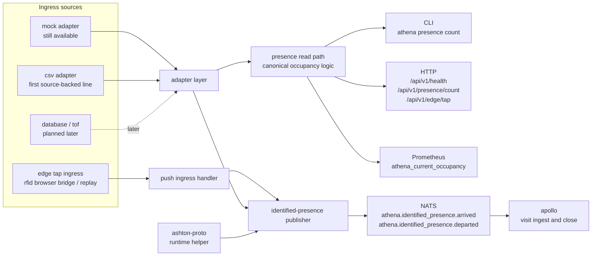

# athena

ATHENA is the first executable service in ASHTON. It owns physical truth:
presence, ingress source handling, occupancy visibility, and the first event
publication path that other repos depend on.

> Current real slice: mock-backed and CSV-backed presence input for the
> canonical occupancy read path, push-based edge tap ingress for identified
> visit lifecycle publication, and shared `ashton-proto` runtime contracts for
> arrival and departure events.

The repo is still growing, but it is no longer docs-first. The important thing
now is to document the real narrow slice honestly while leaving wider adapter,
prediction, and storage plans clearly marked as future work.

## Start Here

| Reader | Start With | Why |
| --- | --- | --- |
| Recruiter or interviewer | [`Runtime Surfaces`](#runtime-surfaces), [`Current State Block`](#current-state-block), [`Why ATHENA Matters`](#why-athena-matters) | These sections show the real service boundary quickly |
| Engineer | [`Architecture`](#architecture), [`Technology Stack`](#technology-stack), [`Known Caveats`](#known-caveats) | These sections show how the service works and where it is still incomplete |
| Operator | [`docs/runbooks/mock-slice.md`](docs/runbooks/mock-slice.md), [`docs/runbooks/source-backed-ingress.md`](docs/runbooks/source-backed-ingress.md), [`docs/runbooks/edge-ingress.md`](docs/runbooks/edge-ingress.md) | These runbooks cover the narrow paths that are actually proven |

## Architecture

The standalone Mermaid source for this flow lives at
[`docs/diagrams/athena-read-and-publish.mmd`](docs/diagrams/athena-read-and-publish.mmd).

## Runtime Surfaces

| Surface | Path / Command | Status | Notes |
| --- | --- | --- | --- |
| HTTP health | `GET /api/v1/health` | Real | Returns service status and adapter name |
| HTTP occupancy count | `GET /api/v1/presence/count` | Real | Reads through the canonical occupancy path |
| HTTP edge tap ingress | `POST /api/v1/edge/tap` | Real when edge ingress is configured | Validates per-node tokens, hashes raw IDs, and publishes identified arrival or departure events |
| Prometheus metrics | `GET /metrics` | Real | Exposes `athena_current_occupancy` from the same read path |
| Serve command | `athena serve` | Real | Starts the HTTP server and can optionally run the publish worker |
| CLI count | `athena presence count --format text|json` | Real | Uses the same read path as HTTP and Prometheus |
| Raw TouchNet replay | `athena edge replay-touchnet` | Real | Replays raw TouchNet report exports through the same edge ingress path used by the live browser bridge |
| One-shot arrival publish | `athena presence publish-identified` | Real | Publishes the current identified-arrival batch through NATS |
| One-shot departure publish | `athena presence publish-identified-departures` | Real | Publishes the current identified-departure batch through NATS |
| Background publish worker | `athena serve` with `ATHENA_NATS_URL` | Real | Dedupes in-process and republishes identified arrivals and departures on a configured interval |
| CSV ingress adapter | `ATHENA_ADAPTER=csv` plus `ATHENA_CSV_PATH` | Real | Loads a bounded physical-truth CSV export into the canonical occupancy read model |
| Prediction endpoints | - | Planned | Preserved in ADRs, not implemented in runtime |
| Additional real ingress adapters | - | Planned | CSV is the only source-backed adapter today |

## Technology Stack

| Layer | Technology | Status | Line | Notes |
| --- | --- | --- | --- | --- |
| Service runtime | Go 1.23 | Instituted | `v0.0.x` -> `v0.3.x` | First executable Go service in the platform |
| HTTP router | chi | Instituted | `v0.1.x` -> `v0.3.x` | Minimal API surface over `net/http` |
| CLI | Cobra | Instituted | `v0.1.x` -> `v0.4.x` | `serve`, `presence count`, publish helpers, and raw TouchNet replay are real |
| Metrics | `prometheus/client_golang` | Instituted | `v0.1.x` -> `v0.3.x` | Reads through the same default occupancy path as CLI and HTTP |
| Eventing | NATS | Instituted | `v0.3.x` | Used for identified visit-lifecycle publication |
| Shared contract | `ashton-proto` generated types + runtime helper | Instituted | `v0.1.x` -> `v0.3.x` | Publishes bytes from the shared contract path |
| Adapter model | Mock adapter | Instituted | `v0.1.x` -> `v0.4.x` | Deterministic fixtures remain available for tests and bounded smoke |
| Real ingress adapter | CSV presence-event adapter plus push-based edge ingress | Real | `v0.4.x` | Local source-backed replay and live edge publication now share one narrow ingress path |
| Database schema | PostgreSQL migration files | Authored, not active in runtime | `v0.5.0` | The current executable slice does not yet query Postgres |
| Container build | Docker multi-stage build | Instituted | `v0.2.x` -> `v0.3.x` | Image build path is real |
| CI | GitHub Actions image workflow | Instituted | `v0.2.x` -> `v0.3.x` | Build and image workflow exist in repo |
| Redis utility layer | Redis | Deferred | later than `v0.5.0` | Useful later for hot counters and short-lived aggregates |
| Prediction engine | EWMA + historical binning | Deferred | `v0.6.0` | ADR-preserved design, not runtime truth yet |

## Data Ownership And Boundaries

| ATHENA Owns | ATHENA Does Not Own |
| --- | --- |
| physical presence events | member auth |
| occupancy counts and source classification | profile visibility and availability intent |
| ingress-source normalization | workout history |
| identified visit-lifecycle publication to the shared event bus | matchmaking and lobby state |

ATHENA is the physical truth layer. Tap-in or presence changes what happened in
the facility. It does not decide whether someone wants to be visible,
recruitable, or part of a team flow. That intent lives in APOLLO.

## Current Publication Path

| Step | Current Behavior |
| --- | --- |
| Source events enter ATHENA | The mock adapter and the CSV adapter feed the canonical read model, while the edge tap ingress accepts push-based browser or replay input for identified lifecycle publication |
| ATHENA filters for publishable visit lifecycle events | Only identified `in` and `out` events qualify |
| ATHENA builds wire bytes | Publication uses the shared `ashton-proto` runtime helper, not a private JSON struct |
| ATHENA publishes to NATS | Subjects are `athena.identified_presence.arrived` and `athena.identified_presence.departed` |
| APOLLO consumes the events | Downstream visit open/close stays idempotent and separate from workout or lobby state |

The publish worker keeps a process-local seen set so it does not republish the
same mock arrivals on every polling interval. Cross-restart replay handling is
still intentionally left to downstream idempotency.

## Edge Observation Note

The TouchNet browser bridge now sends more than just the publishable identity
slice. ATHENA can observe:

- raw `account_raw`
- `account_type` such as student-number-style `Standard` or card-style `ISO`
- `name` when TouchNet resolves it
- `status_message`
- `result` as `pass` or `fail`
- inferred `direction` as `in` or `out`

Current runtime behavior is intentionally split:

- `pass` observations can become identified arrival or departure events
- `fail` observations are logged for operator diagnostics and reconciliation but
  are not yet published as visit-lifecycle events
- the canonical published identifier remains the hashed account value, not the
  raw student or RFID number

This matters because operators may need to reconcile multiple identifiers for
the same person: student number, RFID card number, and resolved name. ATHENA
now ingests enough context to support later admin or operator workflows, but it
does not yet expose a dedicated query API for that observed edge history.

If `Hermes` is the intended admin-facing service, it is a reasonable future
surface for those reconciliation endpoints, with ATHENA remaining the ingest,
hashing, and normalization boundary.

## Known Caveats

| Area | Current caveat | Why it matters |
| --- | --- | --- |
| Container startup | The Docker image entrypoint launches the binary without `serve`, so the default container command does not start the HTTP service yet | Deployment docs must treat the image as requiring an explicit service command until that is fixed |
| Persistence | Postgres schema exists, but the active runtime still serves from adapters rather than DB-backed state | Readers should not assume the authored schema is live |
| Publish dedupe | Republish protection is process-local | Restart safety currently depends on downstream idempotency more than ATHENA memory |
| Health and metrics | The surfaces are useful, but still narrower than a mature production service would expose | Good for the tracer, not yet the final observability story |

## Current State Block

### Already real in this repo

- deterministic mock fixtures back the first read path
- a source-backed CSV adapter can now drive the same occupancy read path locally
- a push-based edge ingress can authenticate per-node clients, hash raw account ids, and publish identified arrival and departure events through NATS
- raw TouchNet access reports can replay through the same edge ingress route used by the live browser bridge
- unknown facilities resolve to a safe zero count instead of panicking or going
  negative
- CLI, HTTP, and Prometheus all read through one canonical occupancy path
- config validation fails fast for invalid adapter and interval settings
- the identified arrival and departure paths can publish through NATS using
  shared `ashton-proto` helper code
- local manual smoke has already been used to exercise both one-shot publish and
  worker-driven publish against real NATS
- the bounded live cluster deployment now proves the identified arrival path can
  publish from ATHENA through in-cluster NATS and into APOLLO visit history

### Real but intentionally narrow

- the CSV adapter is local-runtime proof only and does not widen the existing
  live deployment claim
- the API surface is still intentionally narrow; live edge ingress publishes events but does not yet drive the occupancy read model
- the metric surface is intentionally small
- publication is limited to identified visit lifecycle events because that is
  the only cross-repo slice that is real today
- the live cluster proof still uses the mock adapter and one known claimed tag;
  it does not widen ATHENA into a broader ingress rollout

### Authored but not yet active

- `db/migrations/001_initial.up.sql` defines the first ATHENA relational schema
- the repo includes the first shape for facilities and presence events storage
- future read or analytics work can grow into that schema without redefining the
  ownership model

### Planned next

The planned release lines below are the authoritative expansion path. These
bullets are only the short summary.

- additional real ingress adapters beyond the first CSV line
- broader metrics and diagnostics
- a Postgres-backed read/write path once the tracer requires persistence
- capacity prediction once the read path and event history justify it

### Deferred on purpose

- Redis-backed hot counters before the basic occupancy path needs them
- broad predictive dashboards before prediction itself is real
- any member-intent logic that belongs in APOLLO

## Release History

| Release line | Exact tags | Status | What became real | What stayed deferred |
| --- | --- | --- | --- | --- |
| `v0.0.x` | `v0.0.1` | Shipped | bootstrap line and first executable repo baseline | stable read path and live deployment proof |
| `v0.1.x` | `v0.1.0` | Shipped | first mock-backed occupancy read line | lifecycle publish and source-backed ingress |
| `v0.2.x` | `v0.2.0`, `v0.2.1` | Shipped | read-path hardening and live read deployment line | lifecycle publish and real ingress adapters |
| `v0.3.x` | `v0.3.0`, `v0.3.1` | Shipped | lifecycle publish line plus bounded live arrival proof through Milestone 1.5 | source-backed ingress rollout, persistence, and prediction |

## Planned Release Lines

| Planned tag | Intended purpose | Restrictions | What it should not do yet |
| --- | --- | --- | --- |
| `v0.4.0` | first real ingress adapter for Tracer 10 | keep one source-backed adapter narrow and inspectable | do not widen into persistence or prediction work in the same line |
| `v0.4.1` | source-backed deployment or live departure-close support line | only widen deployed truth as far as the bounded workstream proves | do not imply broad ATHENA ingress rollout or broader APOLLO product deployment |
| `v0.5.0` | persistence and broader diagnostics | activate Postgres-backed state only when a tracer needs it | do not mix storage activation with prediction rollout |
| `v0.6.0` | capacity prediction runtime | build on stable ingress and event history first | do not ship dashboards or predictive UX before prediction itself is real |

## Project Structure

| Path | Purpose |
| --- | --- |
| `cmd/athena/` | CLI entrypoint and serve command |
| `internal/adapter/` | active adapter interface plus mock and CSV implementations |
| `internal/edge/` | push-based edge ingress auth, hashing, and HTTP handling |
| `internal/touchnet/` | raw TouchNet report parsing and replay client |
| `docs/runbooks/source-backed-ingress.md` | local operator path for the first source-backed adapter |
| `docs/runbooks/edge-ingress.md` | local operator path for push-based edge ingress and raw TouchNet replay |
| `internal/presence/` | canonical occupancy and presence read path |
| `internal/publish/` | identified visit-lifecycle build and publish flow |
| `internal/server/` | HTTP routes and health/count handlers |
| `internal/metrics/` | Prometheus registry and gauge wiring |
| `db/migrations/` | first authored relational schema |
| `docs/` | roadmap, ADRs, runbook, growing pains, and diagrams |

## Deployment Boundary

ATHENA owns its own runtime, config, and container build path. Cluster rollout,
GitOps wiring, and infrastructure policy live outside this repo in the
Prometheus/Talos layer. This README documents ATHENA's internal system logic,
not the homelab substrate.

## Docs Map

- [ATHENA diagram](docs/diagrams/athena-read-and-publish.mmd)
- [Glossary](docs/glossary.md)
- [Roadmap](docs/roadmap.md)
- [Growing pains](docs/growing-pains.md)
- [TouchNet edge spike](docs/touchnet-edge-spike.md)
- [TouchNet edge handoff prompt](docs/touchnet-edge-handoff-prompt.md)
- [Mock slice runbook](docs/runbooks/mock-slice.md)
- [Source-backed ingress runbook](docs/runbooks/source-backed-ingress.md)
- [Edge ingress runbook](docs/runbooks/edge-ingress.md)
- [Capacity prediction ADR](docs/adr/002-capacity-prediction.md)
- [ADR index](docs/adr/README.md)

## Why ATHENA Matters

This repo is the first proof that ASHTON is more than a planning exercise. It
already demonstrates a disciplined Go service boundary, contract reuse, event
publication, smoke-tested operational behavior, and a clean separation between
physical truth and higher-level product intent.
