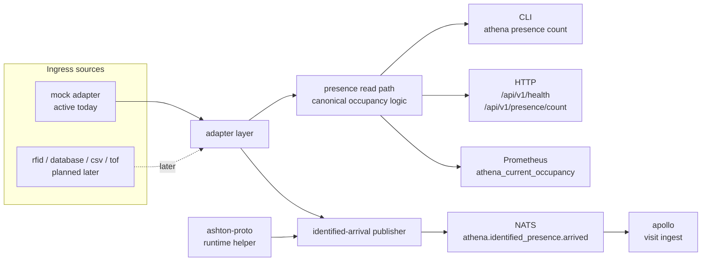

# athena

ATHENA is the first executable service in ASHTON. It owns physical truth:
presence, ingress source handling, occupancy visibility, and the first event
publication path that other repos depend on.

> Current real slice: mock-backed presence input, one canonical occupancy read
> path shared by CLI, HTTP, and Prometheus, plus identified-arrival event
> publication through the shared `ashton-proto` runtime contract.

The repo is still growing, but it is no longer docs-first. The important thing
now is to document the real narrow slice honestly while leaving wider adapter,
prediction, and storage plans clearly marked as future work.

## Architecture

The standalone Mermaid source for this flow lives at
[`docs/diagrams/athena-read-and-publish.mmd`](docs/diagrams/athena-read-and-publish.mmd).

## Runtime Surfaces

| Surface | Path / Command | Status | Notes |
| --- | --- | --- | --- |
| HTTP health | `GET /api/v1/health` | Real | Returns service status and adapter name |
| HTTP occupancy count | `GET /api/v1/presence/count` | Real | Reads through the canonical occupancy path |
| Prometheus metrics | `GET /metrics` | Real | Exposes `athena_current_occupancy` from the same read path |
| Serve command | `athena serve` | Real | Starts the HTTP server and can optionally run the publish worker |
| CLI count | `athena presence count --format text|json` | Real | Uses the same read path as HTTP and Prometheus |
| One-shot publish | `athena presence publish-identified` | Real | Publishes the current identified-arrival batch through NATS |
| Background publish worker | `athena serve` with `ATHENA_NATS_URL` | Real | Dedupes in-process and republishes on a configured interval |
| Prediction endpoints | - | Planned | Preserved in ADRs, not implemented in runtime |
| Real ingress adapters | - | Planned | Mock is the only active adapter today |

## Technology Stack

| Layer | Technology | Status | Notes |
| --- | --- | --- | --- |
| Service runtime | Go 1.23 | Instituted | First executable Go service in the platform |
| HTTP router | chi | Instituted | Minimal API surface over `net/http` |
| CLI | Cobra | Instituted | `serve`, `presence count`, and `publish-identified` are real |
| Metrics | `prometheus/client_golang` | Instituted | Reads through the same default occupancy path as CLI and HTTP |
| Eventing | NATS | Instituted | Used for identified-arrival publication |
| Shared contract | `ashton-proto` generated types + runtime helper | Instituted | Publishes bytes from the shared contract path |
| Adapter model | Mock adapter | Instituted | Deterministic fixtures back the current read slice |
| Database schema | PostgreSQL migration files | Authored, not active in runtime | The current executable slice does not yet query Postgres |
| Container build | Docker multi-stage build | Instituted | Image build path is real |
| CI | GitHub Actions image workflow | Instituted | Build and image workflow exist in repo |
| Redis utility layer | Redis | Deferred | Useful later for hot counters and short-lived aggregates |
| Prediction engine | EWMA + historical binning | Deferred | ADR-preserved design, not runtime truth yet |

## Data Ownership And Boundaries

| ATHENA Owns | ATHENA Does Not Own |
| --- | --- |
| physical presence events | member auth |
| occupancy counts and source classification | profile visibility and availability intent |
| ingress-source normalization | workout history |
| identified-arrival publication to the shared event bus | matchmaking and lobby state |

ATHENA is the physical truth layer. Tap-in or presence changes what happened in
the facility. It does not decide whether someone wants to be visible,
recruitable, or part of a team flow. That intent lives in APOLLO.

## Current Publication Path

| Step | Current Behavior |
| --- | --- |
| Source events enter ATHENA | The mock adapter returns deterministic presence fixtures |
| ATHENA filters for publishable arrivals | Only identified `in` events qualify |
| ATHENA builds wire bytes | Publication uses the shared `ashton-proto` runtime helper, not a private JSON struct |
| ATHENA publishes to NATS | Subject is `athena.identified_presence.arrived` |
| APOLLO consumes the event | Downstream visit creation stays idempotent and separate from workout logging |

The publish worker keeps a process-local seen set so it does not republish the
same mock arrivals on every polling interval. Cross-restart replay handling is
still intentionally left to downstream idempotency.

## Current State Block

### Already real in this repo

- deterministic mock fixtures back the first read path
- unknown facilities resolve to a safe zero count instead of panicking or going
  negative
- CLI, HTTP, and Prometheus all read through one canonical occupancy path
- config validation fails fast for invalid adapter and interval settings
- the identified-arrival path can publish through NATS using shared
  `ashton-proto` helper code
- local manual smoke has already been used to exercise both one-shot publish and
  worker-driven publish against real NATS

### Real but intentionally narrow

- only the mock adapter is active today
- the API surface is limited to health and occupancy count
- the metric surface is intentionally small
- publication is limited to identified arrivals because that is the only
  cross-repo slice that is real today

### Authored but not yet active

- `db/migrations/001_initial.up.sql` defines the first ATHENA relational schema
- the repo includes the first shape for facilities and presence events storage
- future read or analytics work can grow into that schema without redefining the
  ownership model

### Planned next

- real ingress adapters
- broader metrics and diagnostics
- a Postgres-backed read/write path once the tracer requires persistence
- capacity prediction once the read path and event history justify it

### Deferred on purpose

- Redis-backed hot counters before the basic occupancy path needs them
- broad predictive dashboards before prediction itself is real
- any member-intent logic that belongs in APOLLO

## Project Structure

| Path | Purpose |
| --- | --- |
| `cmd/athena/` | CLI entrypoint and serve command |
| `internal/adapter/` | active adapter interface and mock implementation |
| `internal/presence/` | canonical occupancy and presence read path |
| `internal/publish/` | identified-arrival build and publish flow |
| `internal/server/` | HTTP routes and health/count handlers |
| `internal/metrics/` | Prometheus registry and gauge wiring |
| `db/migrations/` | first authored relational schema |
| `docs/` | roadmap, ADRs, runbook, growing pains, and diagrams |

## Deployment Boundary

ATHENA owns its own runtime, config, and container build path. Cluster rollout,
GitOps wiring, and infrastructure policy live outside this repo in the
Prometheus/Talos layer. This README documents ATHENA's internal system logic,
not the homelab substrate.

## Docs Map

- [ATHENA diagram](docs/diagrams/athena-read-and-publish.mmd)
- [Roadmap](docs/roadmap.md)
- [Growing pains](docs/growing-pains.md)
- [Mock slice runbook](docs/runbooks/mock-slice.md)
- [Capacity prediction ADR](docs/adr/002-capacity-prediction.md)
- [ADR index](docs/adr/README.md)

## Why ATHENA Matters

This repo is the first proof that ASHTON is more than a planning exercise. It
already demonstrates a disciplined Go service boundary, contract reuse, event
publication, smoke-tested operational behavior, and a clean separation between
physical truth and higher-level product intent.
